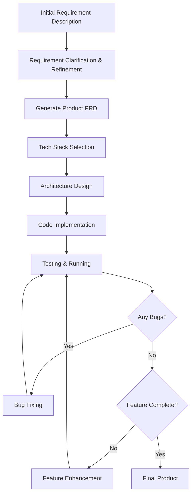

<div align="center">

# Natural Language Programming Guide

<a href="./NLP-guide.md">中文</a> | English

</div>

## Overview

Natural Language Programming is a revolutionary development approach that transforms ideas directly into runnable applications through natural conversations with AI assistants. This guide will walk you through the complete development process from vague concepts to finished products.

## Development Process Overview



## Phase 1: Requirement Expression & Clarification

### 1.1 Initial Requirement Description

**User Input Example:**
```
I want to create a task management application where users can create, 
edit, and delete tasks. It should also have reminder functionality 
and some data analytics features.
```

**AI Response Strategy:**
AI will clarify requirements through a series of questions:
- Is this a web application or mobile app?
- What's the expected user scale?
- Do you need multi-user collaboration features?
- What specific data analytics are you looking for?
- Are there budget and time constraints?

### 1.2 Requirement Refinement Techniques

**Effective Follow-up Questions:**

1. **Functional Detail Inquiries**
   ```
   "Regarding the reminder functionality you mentioned, do you mean:
   - Browser push notifications?
   - Email reminders?
   - Mobile push notifications?
   - Or other forms?"
   ```

2. **User Experience Inquiries**
   ```
   "For task organization, would you prefer:
   - Project-based categorization?
   - Priority-based sorting?
   - Tag system support?
   - Timeline view?"
   ```

3. **Technical Constraint Inquiries**
   ```
   "Regarding deployment and maintenance:
   - Do you need offline functionality?
   - Should data be stored locally or in the cloud?
   - Any specific browser compatibility requirements?"
   ```

### 1.3 Requirement Collection Template

**Complete Requirement Collection Checklist:**

```markdown
## Project Basic Information
- **Project Name**: [Project Name]
- **Project Type**: Web App/Mobile App/Desktop App
- **Target Users**: [User Persona]
- **Use Cases**: [Primary Use Scenarios]

## Core Functional Requirements
- **Must-Have Features**: [Core Feature List]
- **Nice-to-Have Features**: [Value-Added Feature List]
- **Optional Features**: [Future Expandable Features]

## Non-Functional Requirements
- **Performance Requirements**: [Response Time, Concurrent Users]
- **Compatibility Requirements**: [Browser, Device Compatibility]
- **Security Requirements**: [Data Security, User Authentication]
- **Scalability**: [Future Expansion Plans]

## Constraints
- **Time Constraints**: [Development Timeline]
- **Budget Constraints**: [Cost Considerations]
- **Technical Constraints**: [Specific Technology Requirements]
```

## Phase 2: Generate Product PRD

### 2.1 PRD Generation Prompt

**Prompt Template:**
```
Based on our discussion, please help me generate a detailed Product Requirements Document (PRD) including:

1. Product overview and objectives
2. User stories and use cases
3. Detailed functional requirements
4. Non-functional requirements
5. User interface design requirements
6. Data model design
7. System integration requirements
8. Acceptance criteria

Please ensure the PRD is detailed enough to guide subsequent development work.
```

### 2.2 Standard PRD Template

**AI-Generated PRD Structure Example:**

```markdown
# Task Management Application PRD

## 1. Product Overview
### 1.1 Product Vision
Create an intuitive and efficient personal task management system to help users improve productivity.

### 1.2 Target Users
- Knowledge workers
- Students
- Freelancers
- Project managers

## 2. Functional Requirements

### 2.1 Task Management (P0)
- **Create Tasks**: Users can quickly add new tasks
  - Task title (required)
  - Task description (optional)
  - Due date (optional)
  - Priority setting (High/Medium/Low)
  
- **Edit Tasks**: Support editing of all fields
- **Delete Tasks**: Support single and batch deletion
- **Task Status**: To-do/In Progress/Completed

### 2.2 Reminder System (P1)
- Automatic reminders based on due dates
- Browser push notifications
- Customizable reminder intervals

### 2.3 Data Analytics (P2)
- Task completion rate statistics
- Daily/Weekly/Monthly task trends
- Priority distribution charts

## 3. Technical Requirements
### 3.1 Platform Support
- Modern browsers (Chrome 90+, Firefox 85+, Safari 14+)
- Responsive design with mobile support

### 3.2 Performance Requirements
- Page load time < 3 seconds
- Offline viewing support
- Real-time data synchronization

## 4. User Interface Design
### 4.1 Design Principles
- Clean and intuitive interface design
- Compliant with Material Design standards
- Excellent accessibility support

### 4.2 Main Pages
- Task list page
- Task detail page
- Statistics dashboard
- Settings page
```

## Phase 3: Tech Stack Selection

### 3.1 Tech Stack Selection Prompt

**Tech Stack Evaluation Prompt:**
```
Based on the following PRD, please recommend the most suitable tech stack:

[Paste PRD content]

Please consider these factors:
1. Development efficiency and learning curve
2. Community support and documentation quality
3. Performance requirements
4. Scalability and maintainability
5. Deployment ease

Please provide specific technology selection rationale and alternative solutions.
```

### 3.2 Common Tech Stack Recommendations

**Web Application Tech Stacks:**

**Option A: Modern React Tech Stack**
```
Frontend: React 18 + TypeScript + Vite
State Management: Redux Toolkit + RTK Query
UI Components: Material-UI (MUI)
Styling: Emotion + CSS-in-JS
Build Tool: Vite
Testing: Jest + React Testing Library

Backend: Node.js + Express + TypeScript
Database: PostgreSQL + Prisma ORM
Authentication: JWT + bcrypt
API Documentation: Swagger/OpenAPI

Deployment: 
- Frontend: Vercel/Netlify
- Backend: Railway/Render
- Database: Supabase/PlanetScale
```

**Option B: Full-Stack Next.js Tech Stack**
```
Framework: Next.js 14 + TypeScript
Database: PostgreSQL + Drizzle ORM
Authentication: NextAuth.js
UI: Tailwind CSS + shadcn/ui
State Management: Zustand
Deployment: Vercel
```

**Mobile Application Tech Stack:**
```
Cross-Platform: React Native + Expo
State Management: Redux Toolkit
Navigation: React Navigation
UI Components: React Native Elements
Local Storage: AsyncStorage + SQLite
Push Notifications: Expo Notifications
```

### 3.3 Technology Selection Decision Matrix

**Evaluation Criteria Scoring Table:**

| Evaluation Criteria | React Stack | Next.js Stack | React Native |
|-------------------|-------------|---------------|--------------|
| Development Speed | 8/10 | 9/10 | 7/10 |
| Learning Difficulty | 7/10 | 8/10 | 6/10 |
| Community Support | 10/10 | 9/10 | 8/10 |
| Performance | 8/10 | 9/10 | 7/10 |
| Scalability | 9/10 | 8/10 | 7/10 |
| Deployment Ease | 7/10 | 10/10 | 6/10 |
| **Total Score** | **49/60** | **53/60** | **41/60** |

## Phase 4: Architecture Design

### 4.1 Architecture Design Prompt

```
Based on the selected tech stack [Tech Stack Name], please design a detailed system architecture including:

1. Overall architecture diagram and component relationships
2. Frontend component structure and state management
3. Backend API design and data flow
4. Database design and data models
5. Third-party service integration solutions
6. Deployment architecture and CI/CD pipeline

Please provide specific file directory structure and core code framework.
```

### 4.2 Frontend Architecture Design

**Component Architecture Example:**
```
src/
├── components/           # Reusable components
│   ├── ui/              # Basic UI components
│   │   ├── Button/
│   │   ├── Input/
│   │   └── Modal/
│   ├── forms/           # Form components
│   │   ├── TaskForm/
│   │   └── FilterForm/
│   └── charts/          # Chart components
│       └── StatsChart/
├── pages/               # Page components
│   ├── HomePage/
│   ├── TaskDetailPage/
│   └── StatsPage/
├── hooks/               # Custom hooks
│   ├── useTask/
│   ├── useAuth/
│   └── useLocalStorage/
├── services/            # API services
│   ├── taskService.ts
│   ├── authService.ts
│   └── apiClient.ts
├── store/               # State management
│   ├── slices/
│   │   ├── taskSlice.ts
│   │   └── authSlice.ts
│   └── index.ts
├── types/               # TypeScript type definitions
│   ├── task.ts
│   └── user.ts
├── utils/               # Utility functions
│   ├── dateUtils.ts
│   └── validation.ts
└── styles/              # Style files
    ├── globals.css
    └── theme.ts
```

### 4.3 Backend Architecture Design

**API Design Example:**
```
server/
├── src/
│   ├── controllers/     # Controllers
│   │   ├── taskController.ts
│   │   ├── userController.ts
│   │   └── authController.ts
│   ├── models/          # Data models
│   │   ├── Task.ts
│   │   ├── User.ts
│   │   └── index.ts
│   ├── routes/          # Route definitions
│   │   ├── tasks.ts
│   │   ├── users.ts
│   │   └── auth.ts
│   ├── middleware/      # Middleware
│   │   ├── auth.ts
│   │   ├── validation.ts
│   │   └── errorHandler.ts
│   ├── services/        # Business logic
│   │   ├── taskService.ts
│   │   └── notificationService.ts
│   ├── utils/           # Utility functions
│   │   ├── jwt.ts
│   │   └── validators.ts
│   ├── config/          # Configuration files
│   │   ├── database.ts
│   │   └── env.ts
│   └── types/           # Type definitions
│       └── express.d.ts
├── prisma/              # Database schema
│   ├── schema.prisma
│   └── migrations/
└── tests/               # Test files
    ├── unit/
    └── integration/
```

## Phase 5: Code Implementation

### 5.1 Code Generation Strategy

**Step-by-Step Implementation Prompt:**
```
Now let's start implementing the code. Please proceed in the following order:

Step 1: Set up project foundation
- Create project and install dependencies
- Configure development environment
- Set up basic file structure

Step 2: Implement core data models
- Define TypeScript interfaces
- Set up database schema
- Create basic CRUD operations

Step 3: Implement backend API
- User authentication system
- Task management API
- Data validation and error handling

Please start with step 1, and I'll provide feedback after each step is completed.
```

### 5.2 Code Implementation Examples

**Step 1: Project Initialization**
```bash
# Prompt: Please help me create an initial Next.js task management application project structure

# AI-generated command sequence:
npx create-next-app@latest task-manager --typescript --tailwind --app
cd task-manager
npm install @prisma/client prisma
npm install next-auth
npm install @heroicons/react
npm install date-fns
npm install react-hook-form
npm install zod
```

**Step 2: Data Model Definition**
```typescript
// Prompt: Based on the PRD, please create complete TypeScript type definitions and Prisma schema

// AI-generated type definitions:
// types/task.ts
export interface Task {
  id: string;
  title: string;
  description?: string;
  completed: boolean;
  priority: 'LOW' | 'MEDIUM' | 'HIGH';
  dueDate?: Date;
  createdAt: Date;
  updatedAt: Date;
  userId: string;
}

export interface CreateTaskInput {
  title: string;
  description?: string;
  priority?: 'LOW' | 'MEDIUM' | 'HIGH';
  dueDate?: Date;
}

export interface UpdateTaskInput extends Partial<CreateTaskInput> {
  completed?: boolean;
}

// AI-generated Prisma schema:
// prisma/schema.prisma
generator client {
  provider = "prisma-client-js"
}

datasource db {
  provider = "postgresql"
  url      = env("DATABASE_URL")
}

model User {
  id        String   @id @default(cuid())
  email     String   @unique
  name      String?
  tasks     Task[]
  createdAt DateTime @default(now())
  updatedAt DateTime @updatedAt
}

model Task {
  id          String   @id @default(cuid())
  title       String
  description String?
  completed   Boolean  @default(false)
  priority    Priority @default(MEDIUM)
  dueDate     DateTime?
  createdAt   DateTime @default(now())
  updatedAt   DateTime @updatedAt
  userId      String
  user        User     @relation(fields: [userId], references: [id])
}

enum Priority {
  LOW
  MEDIUM
  HIGH
}
```

### 5.3 Progressive Development Process

**Iterative Development Prompt Template:**
```
Current Progress: [Currently completed features]
Next Goal: [Next feature to implement]

Please help me implement the next feature, including:
1. Specific code implementation
2. Related test cases
3. Possible error handling
4. Integration with existing code

After implementation, I'll test and provide feedback.
```

## Phase 6: Testing & Debugging

### 6.1 Testing Strategy

**Testing Prompt:**
```
Please create comprehensive test cases for the following code:

[Paste code]

Including:
1. Unit tests (Jest + Testing Library)
2. Integration tests (API testing)
3. End-to-end tests (Playwright/Cypress)
4. Error scenario testing
5. Edge case testing

Please provide specific test code and run commands.
```

### 6.2 Common Error Types & Solutions

**Error Analysis Prompt Template:**
```
Encountered the following error while running code:

Error message:
```
[Error log]
```

Related code:
```
[Code snippet]
```

Please help me:
1. Analyze the error cause
2. Provide specific fix solutions
3. Explain why this error occurred
4. Suggest how to avoid similar errors
```

### 6.3 Debugging Best Practices

**Debugging Checklist:**

1. **Environment Check**
   - Are dependency versions correct?
   - Are environment variables configured?
   - Is database connection working?

2. **Code Review**
   - Syntax error check
   - Type error fixes
   - Logic error investigation

3. **Performance Monitoring**
   - Loading time testing
   - Memory usage monitoring
   - API response time

## Phase 7: Feature Optimization & Enhancement

### 7.1 User Experience Optimization

**UX Optimization Prompt:**
```
Based on the current task management application, please help me optimize user experience:

Current Features: [List implemented features]
User Feedback: [User usage feedback]

Please suggest:
1. Interface interaction improvements
2. Performance optimization solutions
3. New feature suggestions
4. Accessibility enhancements
5. Mobile optimization

Provide specific implementation solutions for each suggestion.
```

### 7.2 Feature Enhancement Iteration

**Feature Expansion Process:**

1. **User Feedback Collection**
   ```
   Users suggest adding the following features:
   - Task tagging system
   - Pomodoro timer
   - Team collaboration features
   
   Please help me evaluate the priority of these features and design implementation plans.
   ```

2. **Technical Debt Management**
   ```
   Current code has the following issues:
   - Components are too complex
   - API responses are slow
   - Significant code duplication
   
   Please provide refactoring suggestions and implementation steps.
   ```

### 7.3 Performance Optimization

**Performance Optimization Checklist:**

```markdown
## Frontend Performance Optimization
- [ ] Code splitting and lazy loading
- [ ] Image optimization and compression
- [ ] CSS and JS file compression
- [ ] Cache strategy configuration
- [ ] Server-side rendering (SSR)

## Backend Performance Optimization
- [ ] Database query optimization
- [ ] API response caching
- [ ] Database index optimization
- [ ] Connection pool configuration
- [ ] Load balancing configuration

## Monitoring and Analysis
- [ ] Performance monitoring setup
- [ ] Error tracking configuration
- [ ] User behavior analysis
- [ ] Server monitoring
```

## Phase 8: Deployment & Release

### 8.1 Deployment Preparation

**Deployment Checklist Prompt:**
```
Application development is complete, ready to deploy to production environment. Please help me create a deployment plan:

Tech Stack: [Your tech stack]
Deployment Platform: [Vercel/Netlify/AWS etc.]

Should include:
1. Production environment configuration
2. Environment variable setup
3. Database migration
4. CI/CD pipeline configuration
5. Domain and SSL configuration
6. Monitoring and logging setup
7. Backup strategy

Please provide detailed deployment steps and configuration files.
```

### 8.2 CI/CD Configuration

**GitHub Actions Configuration Example:**
```yaml
# .github/workflows/deploy.yml
name: Deploy to Production

on:
  push:
    branches: [main]

jobs:
  test:
    runs-on: ubuntu-latest
    steps:
      - uses: actions/checkout@v3
      - uses: actions/setup-node@v3
        with:
          node-version: '18'
      - run: npm ci
      - run: npm run test
      - run: npm run build

  deploy:
    needs: test
    runs-on: ubuntu-latest
    steps:
      - uses: actions/checkout@v3
      - uses: actions/setup-node@v3
        with:
          node-version: '18'
      - run: npm ci
      - run: npm run build
      - uses: amondnet/vercel-action@v20
        with:
          vercel-token: ${{ secrets.VERCEL_TOKEN }}
          vercel-org-id: ${{ secrets.ORG_ID }}
          vercel-project-id: ${{ secrets.PROJECT_ID }}
          vercel-args: '--prod'
```

## Advanced Techniques & Best Practices

### 1. Prompt Engineering Techniques

**Effective Prompt Structure:**
```
Context: [Project background and current state]
Objective: [Specific goal to achieve]
Constraints: [Technical limitations and requirements]
Output: [Expected output format]
Examples: [Provide examples if needed]
```

**Iterative Optimization Strategy:**
- Start with simple features
- Gradually increase complexity
- Test and provide feedback promptly
- Maintain clean code

### 2. Common Pitfalls to Avoid

**Issues to Watch Out For:**
1. **Over-reliance on AI**: Maintain code understanding and review
2. **Security Oversight**: AI-generated code needs security review
3. **Performance Considerations**: AI may not automatically optimize performance
4. **Best Practices**: Ensure compliance with industry standards

### 3. Team Collaboration

**Multi-person Collaboration Prompt:**
```
This is a team project with current team member skills:
- Frontend Development: [Skill level]
- Backend Development: [Skill level]
- UI/UX Design: [Skill level]

Please provide appropriate guidance for team members of different skill levels:
1. Task allocation suggestions
2. Code style guidelines
3. Collaboration workflow design
4. Code review checklist
```

## Conclusion

Natural Language Programming is a powerful tool that can dramatically improve development efficiency. The keys to success are:

1. **Clear Requirement Expression**: The more detailed the requirements, the better the results
2. **Iterative Development**: Move fast with small steps and timely feedback
3. **Code Quality Awareness**: AI assistance doesn't mean lowering standards
4. **Continuous Learning**: Understand the principles and best practices of generated code

By following this guide's process, you can efficiently develop high-quality applications using natural language. Remember, AI is your programming partner, not a replacement. The best results come from the perfect combination of human creativity and AI capabilities. 