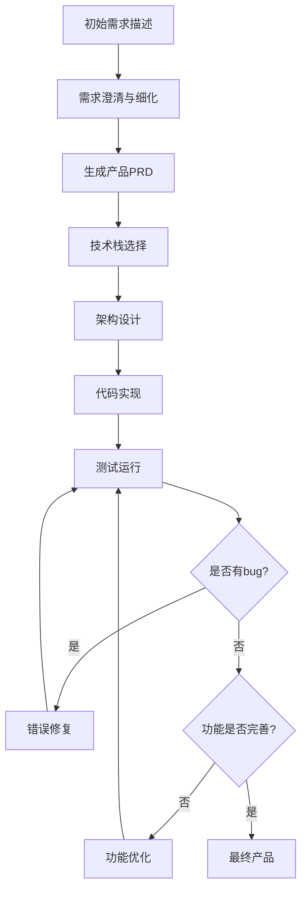

<div align="center">

# 自然语言编程指南

中文 | <a href="./NLP-guide-en.md">English</a>

</div>

## 概述

自然语言编程是一种革命性的开发方式，通过与AI助手的自然对话，将想法直接转换为可运行的应用程序。本指南将带你了解从模糊概念到完整产品的整个开发流程。

## 开发流程概览



## 第一阶段：需求表达与澄清

### 1.1 初始需求描述

**用户输入示例：**
```
我想做一个任务管理应用，用户可以创建、编辑、删除任务，
还要能设置提醒时间，最好有数据统计功能。
```

**AI响应策略：**
AI会通过一系列问题来澄清需求：
- 这是web应用还是移动应用？
- 预期用户规模多大？
- 需要多用户协作功能吗？
- 数据统计具体指什么？
- 有预算和时间限制吗？

### 1.2 需求细化的提问技巧

**有效的追问方式：**

1. **功能细节询问**
   ```
   "你提到的提醒功能，是指：
   - 浏览器推送通知？
   - 邮件提醒？
   - 手机推送？
   - 还是其他形式？"
   ```

2. **用户体验询问**
   ```
   "关于任务的组织方式，你希望：
   - 按项目分类？
   - 按优先级排序？
   - 支持标签系统？
   - 有时间线视图吗？"
   ```

3. **技术约束询问**
   ```
   "关于部署和维护：
   - 需要离线使用吗？
   - 数据存储在本地还是云端？
   - 有特定的浏览器兼容性要求吗？"
   ```

### 1.3 需求收集模板

**完整需求收集清单：**

```markdown
## 项目基本信息
- **项目名称**: [项目名]
- **项目类型**: Web应用/移动应用/桌面应用
- **目标用户**: [用户画像]
- **使用场景**: [主要使用场景]

## 核心功能需求
- **必需功能**: [核心功能列表]
- **期望功能**: [增值功能列表]
- **可选功能**: [未来可扩展功能]

## 非功能需求
- **性能要求**: [响应时间、并发用户数]
- **兼容性要求**: [浏览器、设备兼容性]
- **安全要求**: [数据安全、用户认证]
- **可扩展性**: [未来扩展计划]

## 约束条件
- **时间限制**: [开发周期]
- **预算限制**: [成本考量]
- **技术限制**: [特定技术要求]
```

## 第二阶段：生成产品PRD

### 2.1 PRD生成提示词

**提示词模板：**
```
基于我们的讨论，请帮我生成一份详细的产品需求文档(PRD)，包括：

1. 产品概述和目标
2. 用户故事和使用场景
3. 功能需求详细说明
4. 非功能需求
5. 用户界面设计要求
6. 数据模型设计
7. 系统集成需求
8. 验收标准

请确保PRD足够详细，能够指导后续的开发工作。
```

### 2.2 标准PRD模板

**AI生成的PRD示例结构：**

```markdown
# 任务管理应用 PRD

## 1. 产品概述
### 1.1 产品愿景
创建一个直观、高效的个人任务管理系统，帮助用户提高工作效率。

### 1.2 目标用户
- 知识工作者
- 学生
- 自由职业者
- 项目经理

## 2. 功能需求

### 2.1 任务管理 (P0)
- **创建任务**: 用户可以快速添加新任务
  - 任务标题 (必填)
  - 任务描述 (可选)
  - 截止日期 (可选)
  - 优先级设置 (高/中/低)
  
- **编辑任务**: 支持所有字段的编辑
- **删除任务**: 支持单个删除和批量删除
- **任务状态**: 待办/进行中/已完成

### 2.2 提醒系统 (P1)
- 基于截止日期的自动提醒
- 浏览器推送通知
- 自定义提醒时间间隔

### 2.3 数据统计 (P2)
- 任务完成率统计
- 每日/每周/每月任务趋势
- 优先级分布图表

## 3. 技术需求
### 3.1 平台支持
- 现代浏览器 (Chrome 90+, Firefox 85+, Safari 14+)
- 响应式设计，支持移动端

### 3.2 性能要求
- 页面加载时间 < 3秒
- 支持离线查看
- 数据实时同步

## 4. 用户界面设计
### 4.1 设计原则
- 简洁明了的界面设计
- 符合Material Design规范
- 优秀的可访问性支持

### 4.2 主要页面
- 任务列表页
- 任务详情页
- 统计面板页
- 设置页面
```

## 第三阶段：技术栈选择

### 3.1 技术栈选择提示词

**技术栈评估提示：**
```
基于以下PRD，请为我推荐最适合的技术栈：

[粘贴PRD内容]

请考虑以下因素：
1. 开发效率和学习曲线
2. 社区支持和文档质量
3. 性能要求
4. 扩展性和维护性
5. 部署难易度

请给出具体的技术选择理由，并提供替代方案。
```

### 3.2 常见技术栈推荐

**Web应用技术栈：**

**方案A：现代React技术栈**
```
前端: React 18 + TypeScript + Vite
状态管理: Redux Toolkit + RTK Query
UI组件: Material-UI (MUI)
样式: Emotion + CSS-in-JS
构建工具: Vite
测试: Jest + React Testing Library

后端: Node.js + Express + TypeScript
数据库: PostgreSQL + Prisma ORM
认证: JWT + bcrypt
API文档: Swagger/OpenAPI

部署: 
- 前端: Vercel/Netlify
- 后端: Railway/Render
- 数据库: Supabase/PlanetScale
```

**方案B：全栈Next.js技术栈**
```
框架: Next.js 14 + TypeScript
数据库: PostgreSQL + Drizzle ORM
认证: NextAuth.js
UI: Tailwind CSS + shadcn/ui
状态管理: Zustand
部署: Vercel
```

**移动应用技术栈：**
```
跨平台: React Native + Expo
状态管理: Redux Toolkit
导航: React Navigation
UI组件: React Native Elements
本地存储: AsyncStorage + SQLite
推送通知: Expo Notifications
```

### 3.3 技术选择决策矩阵

**评估标准权重表：**

| 评估标准 | React技术栈 | Next.js技术栈 | React Native |
|---------|------------|---------------|--------------|
| 开发速度 | 8/10 | 9/10 | 7/10 |
| 学习难度 | 7/10 | 8/10 | 6/10 |
| 社区支持 | 10/10 | 9/10 | 8/10 |
| 性能表现 | 8/10 | 9/10 | 7/10 |
| 扩展性 | 9/10 | 8/10 | 7/10 |
| 部署便利 | 7/10 | 10/10 | 6/10 |
| **总分** | **49/60** | **53/60** | **41/60** |

## 第四阶段：架构设计

### 4.1 架构设计提示词

```
基于选定的技术栈 [技术栈名称]，请为我设计详细的系统架构，包括：

1. 整体架构图和组件关系
2. 前端组件结构和状态管理
3. 后端API设计和数据流
4. 数据库设计和数据模型
5. 第三方服务集成方案
6. 部署架构和CI/CD流程

请提供具体的文件目录结构和核心代码框架。
```

### 4.2 前端架构设计

**组件架构示例：**
```
src/
├── components/           # 可复用组件
│   ├── ui/              # 基础UI组件
│   │   ├── Button/
│   │   ├── Input/
│   │   └── Modal/
│   ├── forms/           # 表单组件
│   │   ├── TaskForm/
│   │   └── FilterForm/
│   └── charts/          # 图表组件
│       └── StatsChart/
├── pages/               # 页面组件
│   ├── HomePage/
│   ├── TaskDetailPage/
│   └── StatsPage/
├── hooks/               # 自定义hooks
│   ├── useTask/
│   ├── useAuth/
│   └── useLocalStorage/
├── services/            # API服务
│   ├── taskService.ts
│   ├── authService.ts
│   └── apiClient.ts
├── store/               # 状态管理
│   ├── slices/
│   │   ├── taskSlice.ts
│   │   └── authSlice.ts
│   └── index.ts
├── types/               # TypeScript类型定义
│   ├── task.ts
│   └── user.ts
├── utils/               # 工具函数
│   ├── dateUtils.ts
│   └── validation.ts
└── styles/              # 样式文件
    ├── globals.css
    └── theme.ts
```

### 4.3 后端架构设计

**API设计示例：**
```
server/
├── src/
│   ├── controllers/     # 控制器
│   │   ├── taskController.ts
│   │   ├── userController.ts
│   │   └── authController.ts
│   ├── models/          # 数据模型
│   │   ├── Task.ts
│   │   ├── User.ts
│   │   └── index.ts
│   ├── routes/          # 路由定义
│   │   ├── tasks.ts
│   │   ├── users.ts
│   │   └── auth.ts
│   ├── middleware/      # 中间件
│   │   ├── auth.ts
│   │   ├── validation.ts
│   │   └── errorHandler.ts
│   ├── services/        # 业务逻辑
│   │   ├── taskService.ts
│   │   └── notificationService.ts
│   ├── utils/           # 工具函数
│   │   ├── jwt.ts
│   │   └── validators.ts
│   ├── config/          # 配置文件
│   │   ├── database.ts
│   │   └── env.ts
│   └── types/           # 类型定义
│       └── express.d.ts
├── prisma/              # 数据库schema
│   ├── schema.prisma
│   └── migrations/
└── tests/               # 测试文件
    ├── unit/
    └── integration/
```

## 第五阶段：代码实现

### 5.1 代码生成策略

**分步实现提示词：**
```
现在开始实现代码，请按以下顺序进行：

第一步：设置项目基础架构
- 创建项目并安装依赖
- 配置开发环境
- 设置基础文件结构

第二步：实现核心数据模型
- 定义TypeScript接口
- 设置数据库schema
- 创建基础的CRUD操作

第三步：实现后端API
- 用户认证系统
- 任务管理API
- 数据验证和错误处理

请先从第一步开始，我会在每一步完成后给你反馈。
```

### 5.2 代码实现示例

**第一步：项目初始化**
```bash
# 提示词：请帮我创建一个Next.js任务管理应用的初始项目结构

# AI生成的命令序列：
npx create-next-app@latest task-manager --typescript --tailwind --app
cd task-manager
npm install @prisma/client prisma
npm install next-auth
npm install @heroicons/react
npm install date-fns
npm install react-hook-form
npm install zod
```

**第二步：数据模型定义**
```typescript
// 提示词：基于PRD，请创建完整的TypeScript类型定义和Prisma schema

// AI生成的类型定义：
// types/task.ts
export interface Task {
  id: string;
  title: string;
  description?: string;
  completed: boolean;
  priority: 'LOW' | 'MEDIUM' | 'HIGH';
  dueDate?: Date;
  createdAt: Date;
  updatedAt: Date;
  userId: string;
}

export interface CreateTaskInput {
  title: string;
  description?: string;
  priority?: 'LOW' | 'MEDIUM' | 'HIGH';
  dueDate?: Date;
}

export interface UpdateTaskInput extends Partial<CreateTaskInput> {
  completed?: boolean;
}

// AI生成的Prisma schema：
// prisma/schema.prisma
generator client {
  provider = "prisma-client-js"
}

datasource db {
  provider = "postgresql"
  url      = env("DATABASE_URL")
}

model User {
  id        String   @id @default(cuid())
  email     String   @unique
  name      String?
  tasks     Task[]
  createdAt DateTime @default(now())
  updatedAt DateTime @updatedAt
}

model Task {
  id          String   @id @default(cuid())
  title       String
  description String?
  completed   Boolean  @default(false)
  priority    Priority @default(MEDIUM)
  dueDate     DateTime?
  createdAt   DateTime @default(now())
  updatedAt   DateTime @updatedAt
  userId      String
  user        User     @relation(fields: [userId], references: [id])
}

enum Priority {
  LOW
  MEDIUM
  HIGH
}
```

### 5.3 渐进式开发流程

**迭代开发提示词模板：**
```
当前进度：[当前完成的功能]
下一步目标：[下一个要实现的功能]

请帮我实现下一步功能，需要：
1. 具体的代码实现
2. 相关的测试用例
3. 可能的错误处理
4. 与现有代码的集成方式

实现完成后，我会测试运行并反馈结果。
```

## 第六阶段：测试与调试

### 6.1 测试策略

**测试提示词：**
```
请为以下代码创建全面的测试用例：

[粘贴代码]

包括：
1. 单元测试 (Jest + Testing Library)
2. 集成测试 (API测试)
3. 端到端测试 (Playwright/Cypress)
4. 错误场景测试
5. 边界条件测试

请提供具体的测试代码和运行命令。
```

### 6.2 常见错误类型与解决

**错误分析提示词模板：**
```
运行代码时遇到以下错误：

错误信息：
```
[错误日志]
```

相关代码：
```
[相关代码片段]
```

请帮我：
1. 分析错误原因
2. 提供具体的修复方案
3. 解释为什么会出现这个错误
4. 建议如何避免类似错误
```

### 6.3 调试最佳实践

**调试checklist：**

1. **环境检查**
   - 依赖版本是否正确
   - 环境变量是否配置
   - 数据库连接是否正常

2. **代码审查**
   - 语法错误检查
   - 类型错误修复
   - 逻辑错误排查

3. **性能监控**
   - 加载时间测试
   - 内存使用监控
   - API响应时间

## 第七阶段：功能优化与完善

### 7.1 用户体验优化

**UX优化提示词：**
```
基于当前的任务管理应用，请帮我优化用户体验：

当前功能：[列出已实现功能]
用户反馈：[用户使用反馈]

请建议：
1. 界面交互改进
2. 性能优化方案
3. 新功能建议
4. 可访问性提升
5. 移动端适配优化

对每个建议提供具体的实现方案。
```

### 7.2 功能增强迭代

**功能扩展流程：**

1. **用户反馈收集**
   ```
   用户建议增加以下功能：
   - 任务标签系统
   - 番茄钟计时器
   - 团队协作功能
   
   请帮我评估这些功能的优先级，并设计实现方案。
   ```

2. **技术债务处理**
   ```
   当前代码存在以下问题：
   - 组件过于复杂
   - API响应慢
   - 代码重复较多
   
   请提供重构建议和实现步骤。
   ```

### 7.3 性能优化

**性能优化检查清单：**

```markdown
## 前端性能优化
- [ ] 代码分割和懒加载
- [ ] 图片优化和压缩
- [ ] CSS和JS文件压缩
- [ ] 缓存策略配置
- [ ] 服务端渲染 (SSR)

## 后端性能优化
- [ ] 数据库查询优化
- [ ] API响应缓存
- [ ] 数据库索引优化
- [ ] 连接池配置
- [ ] 负载均衡配置

## 监控和分析
- [ ] 性能监控设置
- [ ] 错误追踪配置
- [ ] 用户行为分析
- [ ] 服务器监控
```

## 第八阶段：部署与发布

### 8.1 部署准备

**部署清单提示词：**
```
应用开发完成，准备部署到生产环境。请帮我制定部署方案：

技术栈：[你的技术栈]
部署平台：[Vercel/Netlify/AWS等]

需要包括：
1. 生产环境配置
2. 环境变量设置
3. 数据库迁移
4. CI/CD流程配置
5. 域名和SSL配置
6. 监控和日志设置
7. 备份策略

请提供详细的部署步骤和配置文件。
```

### 8.2 CI/CD配置

**GitHub Actions配置示例：**
```yaml
# .github/workflows/deploy.yml
name: Deploy to Production

on:
  push:
    branches: [main]

jobs:
  test:
    runs-on: ubuntu-latest
    steps:
      - uses: actions/checkout@v3
      - uses: actions/setup-node@v3
        with:
          node-version: '18'
      - run: npm ci
      - run: npm run test
      - run: npm run build

  deploy:
    needs: test
    runs-on: ubuntu-latest
    steps:
      - uses: actions/checkout@v3
      - uses: actions/setup-node@v3
        with:
          node-version: '18'
      - run: npm ci
      - run: npm run build
      - uses: amondnet/vercel-action@v20
        with:
          vercel-token: ${{ secrets.VERCEL_TOKEN }}
          vercel-org-id: ${{ secrets.ORG_ID }}
          vercel-project-id: ${{ secrets.PROJECT_ID }}
          vercel-args: '--prod'
```

## 高级技巧与最佳实践

### 1. 提示词工程技巧

**有效提示词结构：**
```
背景：[项目背景和当前状态]
目标：[要实现的具体目标]
约束：[技术限制和要求]
输出：[期望的输出格式]
示例：[如果需要，提供示例]
```

**迭代优化策略：**
- 从简单功能开始
- 逐步增加复杂度
- 及时测试和反馈
- 保持代码整洁

### 2. 常见陷阱避免

**需要注意的问题：**
1. **过度依赖AI**：保持代码理解和审查
2. **安全性忽视**：AI生成的代码需要安全审查
3. **性能考虑**：AI可能不会自动优化性能
4. **最佳实践**：确保遵循行业标准

### 3. 团队协作

**多人协作时的提示词：**
```
这是一个团队项目，当前团队成员技能：
- 前端开发：[技能水平]
- 后端开发：[技能水平]
- UI/UX设计：[技能水平]

请为不同技能水平的团队成员提供相应的：
1. 任务分工建议
2. 代码风格指南
3. 协作流程设计
4. 代码审查清单
```

## 结语

自然语言编程是一个强大的工具，能够极大提高开发效率。但成功的关键在于：

1. **清晰的需求表达**：越详细的需求，越好的结果
2. **迭代式开发**：小步快跑，及时反馈
3. **代码质量意识**：AI辅助不等于降低标准
4. **持续学习**：了解生成代码的原理和最佳实践

通过遵循本指南的流程，你可以用自然语言高效地开发出高质量的应用程序。记住，AI是你的编程伙伴，而不是替代品。最好的结果来自人类创造力和AI能力的完美结合。 