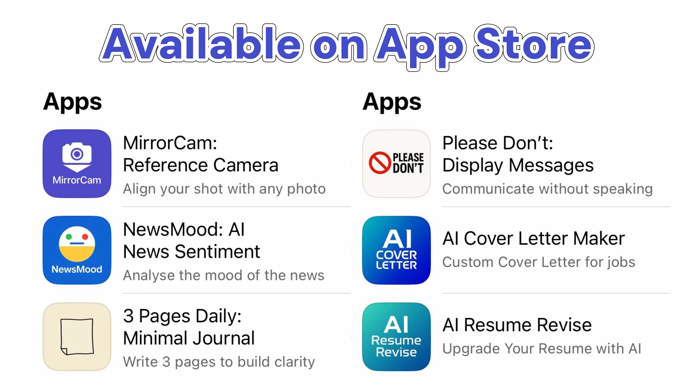

<div align="center">

# My Miraculous 60-Day Journey: Building 6 iOS Apps

<a href="./ios-app-experience.md">中文</a> | English

</div>

## Introduction

As a product manager with zero coding background, I successfully developed 6 iOS applications using ChatGPT and Xcode over the past three months and got them all live on the App Store. This experience made me deeply appreciate the power of AI programming and validated the concept that "anyone can become an independent developer."

<div align="center">

</div>

## Development Environment and Tools

### Core Tool Stack
- **ChatGPT**: Code generation, problem-solving, design guidance
- **Xcode**: Official iOS development IDE
- **Sketch**: Prototyping for complex apps
- **Screenshot tools**: Quick error feedback and communication

The choice of ChatGPT + Xcode was straightforward: ChatGPT understands natural language requirements and generates Swift code, while Xcode is the official iOS development environment. Together, they enable rapid transformation from ideas to functional applications.

## Detailed Development Workflow

### 1. Requirements Analysis and Design Phase

**For Simple Apps:**
For apps with relatively simple functionality, I directly describe requirements to ChatGPT in plain language:

```
I want to develop a timer app with the following features:
- Set countdown time
- Start/pause/reset buttons
- Play notification sound when time expires
- Clean, minimalist interface design
Please generate Swift code for this
```

**For Complex Apps:**
For feature-rich applications, I first create prototypes in Sketch, including:
- Page structure and layout
- User interaction flows
- Key functionality operation paths

These prototypes help me communicate requirements more clearly to ChatGPT and ensure the final product matches my vision.

### 2. Code Generation and Implementation

**ChatGPT Conversation Pattern:**
```
Based on the prototype I've provided, please generate a SwiftUI application with these pages:
1. Launch screen
2. Main functionality page
3. Settings page
Please provide code for each page separately and ensure proper navigation between them.
```

ChatGPT typically provides complete code structure including:
- View layer code (SwiftUI)
- Data models
- Business logic
- Navigation controls

### 3. Code Testing and Debugging

**Copy-Paste Workflow:**
1. Copy ChatGPT-generated code into Xcode
2. Use Xcode's preview feature for quick visual checks
3. Run simulator for functional testing

**Error Handling Process:**
When encountering errors, my approach is remarkably straightforward:
1. **Screenshot the error page**: Include complete error information
2. **Send to ChatGPT**: Let it analyze the problem and provide solutions
3. **Apply fix code**: Usually ChatGPT accurately identifies issues and provides working fixes

The advantage of this approach is that ChatGPT can directly understand error context from screenshots, providing more precise solutions.

### 4. Iterative Improvement

After completing basic functionality, I continue conversations with ChatGPT:
- "This interface looks too basic, can you help me beautify it?"
- "Users find the interaction unintuitive, can you optimize the flow?"
- "Can you add a data analytics feature?"

## Key Insights from 6 Apps in 60 Days

### 1. Design the User Journey Before Writing Code
> "Apps are not features. They are experiences."

Before writing any code, I design the complete user journey. When the flow is clear, the code is clean — and so is your mind.

### 2. Forget "MVP", Think "MFP" — Most Functional Product
Abandon the "Minimum Viable Product" concept and focus on "Most Functional Product":
- No fancy UI
- No feature bloat
- Just solve the real problem
- Launch quickly, let data and feedback guide next moves

### 3. Templates Are Leverage, Not Shortcuts
I reuse the same:
- Onboarding flows
- Purchase and payment processes
- Basic interface layouts
- Common feature components

Small savings add up to massive efficiency gains. Compounding time = compounding output.

### 4. Build with App Review in Mind
Ignoring privacy policies, payment rules, or UX guidelines will trap you in rejection cycles for weeks.
- Respect the rules early = move faster later

### 5. Marketing Isn't Optional
Your app starts selling itself from the first screenshot, not from the first line of code:
- Copy and messaging
- Product positioning
- Visual design

These are part of "building", not afterthoughts.

## App Store Launch Process

### Complete Reliance on ChatGPT for Publishing
Every aspect of the launch process involved ChatGPT assistance:

**1. App Logo Design**
```
Please help me design a logo for my timer app with these requirements:
- Clean and modern
- Follows iOS design guidelines
- Provide multiple size versions
- Include design rationale explanation
```

**2. App Naming**
```
Please suggest names for my timer app with these criteria:
- Easy to remember
- Reflects core functionality
- App Store search-friendly
- Provide both English and localized versions
```

**3. App Description**
```
Please write an App Store description including:
- Compelling headline
- Core feature highlights
- User pain points and solutions
- Keyword optimization
- App Store guideline compliance
```

**4. Screenshots and Previews**
ChatGPT guided me on:
- Selecting screens that best showcase functionality
- Optimal screenshot sizes and specifications
- How to highlight key selling points
- Preview video creation tips

## Challenges and Solutions

### Technical Challenges
1. **Code Errors**: Screenshot + ChatGPT analysis solved nearly everything quickly
2. **Feature Implementation**: Refined requirement descriptions led to more precise code
3. **Performance Optimization**: Described lag symptoms to ChatGPT for optimization suggestions

### Non-Technical Challenges
1. **Unclear Requirements**: Created prototypes first to clarify every functionality detail
2. **Design Aesthetics**: Referenced excellent apps and asked ChatGPT to emulate styles
3. **User Experience Issues**: Multiple iterations, solving one specific problem at a time


## Advice for Other Non-Technical Developers

### 1. Start Simple
Choose functionally simple apps for your first project: calculator, timer, notepad, etc.

### 2. Describe Requirements in Detail
The more detailed your requirements to ChatGPT, the higher quality code you'll receive. Don't be afraid to be "verbose."

### 3. Learn to Ask the Right Questions
- Don't ask: "Help me build an app"
- Do ask: "Help me implement a page with X functionality where users can complete W task through Z operation"

### 4. Embrace Errors
Bugs are normal and each error is a learning opportunity. Screenshot + ChatGPT inquiry is the most efficient solution method.

### 5. Maintain an Iterative Mindset
Don't expect to create perfect apps in one attempt. Launch quickly, collect feedback, improve continuously.


Through this 60-day experience, I deeply understand the power of AI programming. It doesn't just enable non-technical people to develop applications — it fundamentally changes the barriers and methods of software development.

While I still don't know traditional programming, I learned:
- How to collaborate effectively with AI
- Product thinking and user experience design
- Basic iOS platform guidelines and constraints
- How to rapidly validate and iterate ideas

My future plans include:
- Developing more complex apps to explore AI programming boundaries
- Sharing more practical development tips and experiences
- Helping more people realize their creative ideas through AI


In the AI era, ideas matter more than technical skills. If you have good creative concepts, don't abandon them because you can't code. ChatGPT and other AI tools have opened a new door for us.

The key is finding a workflow that suits you, maintaining a continuous learning mindset, and believing that AI can help you realize any idea.

