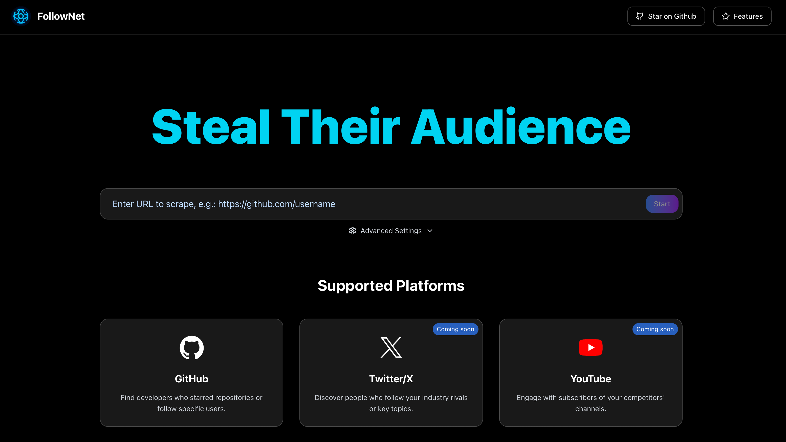

<div align="center">

# How I Built My Websites

<a href="./web-experience.md">中文</a> | English

</div>

## Introduction

With absolutely no programming background, I successfully developed and launched two complete website projects using Cursor. From pure frontend pages to complex full-stack applications, the combination of Cursor + Claude-4-Sonnet completely transformed my understanding of web development. This article shares my detailed development experience, technical choices, and practical insights.


## My Two Website Projects

### Project 1: Global Travel Guide
- **Type**: Pure frontend travel content platform
- **GitHub**: [https://github.com/wendy7756/globaltravelguide](https://github.com/wendy7756/globaltravelguide)
- **Website**: [localtravelguide.fun](https://localtravelguide.fun)
- **Development Time**: 24 hours
- **Tech Stack**: Astro + Markdown + Vercel


### Project 2: FollowNet
- **Type**: Social media competitor analysis tool
- **GitHub**: [https://github.com/wendy7756/FollowNet](https://github.com/wendy7756/FollowNet)
- **Website**: [follownet.online](https://follownet.online)
- **Development Time**: 24 hours
- **Tech Stack**: Next.js + Python + Vercel + Backend Deployment



## Why Choose Cursor?

### Core Advantages of Cursor
1. **Perfect Frontend Development Experience**: Optimized for web development with extremely intelligent code suggestions and auto-completion
2. **Seamless GitHub Integration**: One-click code push to GitHub, coupled with Vercel for automatic deployment
3. **Powerful AI Assistant**: Built-in Claude-3.5-Sonnet for direct editor conversation
4. **Real-time Preview**: See effects immediately after code modification, extremely high development efficiency
5. **Zero Configuration Setup**: Start coding immediately upon opening Cursor, no complex environment configuration needed

### Comparison with Traditional Development
**Traditional Approach:**
- Need to learn complex development environment configuration
- Manual code version management and deployment
- Need to consult documentation or Stack Overflow for problems

**Cursor Approach:**
- One tool solves all problems
- AI directly generates code and explains principles
- Screenshot bugs to AI for instant fixes

## Detailed Development Process

### Step 1: Project Planning and Design

**Requirements Analysis Conversation Example:**
```
I want to create a travel guide website with the following features:
- Homepage showcasing featured destinations
- Detailed city guide pages
- Food, attractions, and accommodation recommendations
- Responsive design for mobile and desktop
- SEO-friendly with fast loading
Please recommend a suitable tech stack
```

**Cursor/Claude Response:**
- Recommend Astro framework (static site generation, SEO-friendly)
- Markdown content management (as simple as editing Notion)
- Tailwind CSS responsive design
- Vercel one-click deployment

### Step 2: Tech Stack Selection and Configuration

**Global Travel Guide Tech Stack:**
```bash
# Direct conversation in Cursor
Please help me create an Astro project including:
- Homepage template
- City detail page template
- Navigation component
- Responsive layout
- Tailwind CSS configuration
```

**FollowNet Tech Stack:**
```bash
# More complex full-stack project
Please help me set up a Next.js project needing:
- Frontend user interface
- Python backend API
- Data scraping functionality
- User authentication system
- Deployment configuration
```

### Step 3: Detailed Development Process

**1. Frontend Development**
Advantages of using Cursor:
- **Component Generation**: Describe requirements, AI directly generates React/Astro components
- **Style Debugging**: Real-time preview, write and see effects simultaneously
- **Responsive Adaptation**: AI automatically handles mobile adaptation

```javascript
// Example component generated by Cursor
const DestinationCard = ({ city, image, description }) => {
  return (
    <div className="bg-white rounded-lg shadow-md overflow-hidden hover:shadow-lg transition-shadow">
      
      <div className="p-6">
        <h3 className="text-xl font-bold mb-2">{city}</h3>
        <p className="text-gray-600">{description}</p>
      </div>
    </div>
  );
};
```

**2. Content Management**
Advantages of using Markdown:
- Create pages like writing documents
- Version control friendly
- Natural SEO support

```markdown
---
title: "Tokyo Travel Guide"
date: "2024-01-15"
image: "/images/tokyo.jpg"
---

# Complete Tokyo Guide

Tokyo is a city where tradition and modernity blend perfectly...
```

**3. Backend Development (FollowNet Project)**
```python
# Python scraper code generated by Cursor
import requests
from bs4 import BeautifulSoup

class GitHubScraper:
    def __init__(self):
        self.session = requests.Session()
    
    def get_followers(self, username):
        # AI-generated data scraping logic
        url = f"https://api.github.com/users/{username}/followers"
        response = self.session.get(url)
        return response.json()
```

### Step 4: Deployment and Launch

**Automated Deployment Process:**
1. **Cursor → GitHub**: One-click code push
2. **GitHub → Vercel**: Automatic deployment trigger
3. **Domain Binding**: Alibaba Cloud domain $2/year
4. **SSL Certificate**: Vercel automatic configuration

```bash
# Git operations in Cursor
git add .
git commit -m "Initial website launch"
git push origin main
# Vercel automatic deployment complete!
```

## Core Development Techniques

### 1. Efficient AI Conversation Techniques

**Good Question Format:**
```
My website homepage loads slowly, users report poor experience.
Current homepage contains: 10 high-res images, 3 videos, complex animations.
Please help optimize performance with requirements:
- First screen load time under 2 seconds
- Maintain visual effects unchanged
- Provide specific code modification solutions
```

**Poor Question Format:**
```
Website slow, what to do?
```

### 2. Maximizing Real-time Preview

**Development Workflow:**
1. Modify code in Cursor
2. Local real-time preview to check effects
3. Push to GitHub when satisfied
4. Vercel automatic deployment, online preview
5. Return to step 1 if issues found

### 3. Debugging and Problem Solving

**Screenshot + AI Analysis Method:**
- Screenshot errors and send to Claude
- Describe expected vs actual effects
- AI provides precise fix solutions

**Example Conversation:**
```
My website displays incorrectly on mobile (attach screenshot)
Expected: Navigation menu should collapse into hamburger menu
Actual: Navigation menu overflows screen
Please help fix responsive layout issues
```

## Experience Comparison Between Two Projects

### Global Travel Guide (Pure Frontend Project)
**Advantages:**
- Simple development, content-focused
- Extremely fast loading (static site)
- Good SEO performance
- Low maintenance cost

**Suitable Scenarios:**
- Content display websites
- Blogs and portfolios
- Corporate websites
- Documentation sites

### FollowNet (Full-stack Project)
**Advantages:**
- Richer features, strong user interaction
- Dynamic data updates
- Can integrate complex business logic
- High commercialization potential

**Challenges:**
- Complex backend deployment
- Need to consider database and API design
- More difficult performance optimization
- Higher security requirements

## Cost Analysis: True Zero Cost

### Free Resources List
- **Development Tool**: Cursor (free quota sufficient for personal use)
- **Code Hosting**: GitHub (free for open source projects)
- **Website Deployment**: Vercel (free for personal projects)
- **SSL Certificate**: Let's Encrypt (free)
- **AI Assistant**: Claude-3.5-Sonnet (free quota)

### Only Cost: Domain
- **Alibaba Cloud Domain**: $2/year
- **Alternative**: Vercel free subdomain (completely $0 cost)

### Total Cost Comparison
**Traditional Approach:**
- Cloud server: $5-20/month
- Database: $10-50/month
- CDN: $5-15/month
- **Annual cost: $240-1020**

**My Approach:**
- Domain: $2/year
- Others: $0
- **Annual cost: $2**

## Advice for Other Non-technical Developers

### 1. Start with Simple Projects
**Recommended First Project Types:**
- Personal blog
- Product showcase page
- Resume website
- Event promotion page

### 2. Fully Utilize Cursor's AI Features
**Essential Techniques:**
- Learn to describe clear requirements
- Use screenshot functionality for problem feedback
- Try different questioning approaches
- Have AI explain code logic

### 3. Establish Correct Development Mindset
**Important Principles:**
- Don't need to understand every line of code, solving problems matters
- Encountering errors is normal, AI can help solve quickly
- Study excellent websites, learn by imitation
- Maintain iterative thinking, continuous improvement

### 4. Tech Stack Selection Recommendations
**Pure Frontend Projects:**
- Astro + Markdown (content websites)
- React + Tailwind (interactive websites)

**Full-stack Projects:**
- Next.js + Prisma (modern full-stack)
- Python + FastAPI (AI/data projects)

### 5. Deployment and Maintenance Strategy
**Recommended Process:**
- Development: Cursor local development
- Version control: GitHub
- Deployment: Vercel automatic deployment
- Domain: Cheap domain providers
- Monitoring: Vercel Analytics (free)

## Practical Tool Recommendations

### Development Tools
- **Cursor**: Primary development environment
- **Chrome DevTools**: Debugging tools


### Deployment and Operations
- **Vercel**: Website deployment
- **Cloudflare**: CDN and security


---

Through developing these two projects, I deeply understand the power of modern web development tools. The combination of Cursor + AI enables people without programming backgrounds to quickly build professional-level websites.


What matters isn't whether you can program, but whether you have good ideas and problem-solving abilities. AI tools can help anyone become a web developer.

If you have website ideas you want to implement, don't hesitate — open Cursor and start your first line of code!

