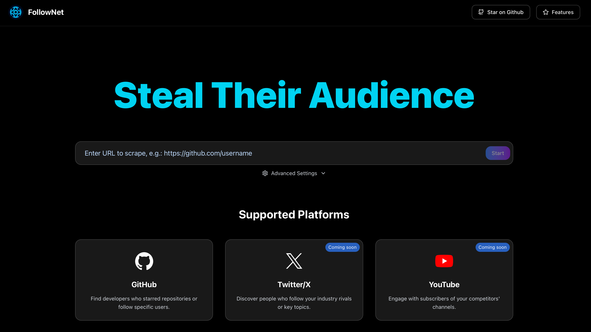

<div align="center">

# 我的网站开发之旅

中文 | <a href="./web-experience-en.md">English</a>

</div>

## 前言

作为一个没有编程基础的人，我使用 Cursor 成功开发并上线了两个完整的网站项目。从纯前端页面到复杂的全栈应用，Cursor + Claude-4-Sonnet 的组合彻底改变了我对Web开发的认知。这篇文章将详细分享我的开发经历、技术选择和实用经验。


## 我的两个网站项目

### 项目一：Global Travel Guide
- **类型**：纯前端旅游内容平台
- **GitHub**：[https://github.com/wendy7756/globaltravelguide](https://github.com/wendy7756/globaltravelguide)
- **网址**：[localtravelguide.fun](https://localtravelguide.fun)
- **开发时间**：24小时
- **技术栈**：Astro + Markdown + Vercel


### 项目二：FollowNet
- **类型**：社交媒体竞争对手分析工具
- **GitHub**：[https://github.com/wendy7756/FollowNet](https://github.com/wendy7756/FollowNet)
- **网址**：[follownet.online](https://follownet.online)
- **开发时间**：48小时
- **技术栈**：Next.js + Python + Vercel + 后端部署



## 为什么选择Cursor？

### Cursor的核心优势
1. **完美的前端开发体验**：专为Web开发优化，代码提示和自动补全极其智能
2. **无缝GitHub集成**：一键推送代码到GitHub，配合Vercel实现自动部署
3. **强大的AI助手**：内置Claude-3.5-Sonnet，可以直接在编辑器中对话
4. **实时预览功能**：修改代码后立即看到效果，开发效率极高
5. **零配置启动**：打开Cursor就能开始写代码，不需要复杂的环境配置

### 与传统开发方式的对比
**传统方式：**
- 需要学习复杂的开发环境配置
- 手动管理代码版本和部署
- 遇到问题需要查文档或Stack Overflow

**Cursor方式：**
- 一个工具解决所有问题
- AI直接生成代码并解释原理
- 遇到bug截图给AI，秒速修复

## 详细开发流程

### 第一步：项目规划和设计

**需求分析对话示例：**
```
我想做一个旅游攻略网站，需要以下功能：
- 首页展示精选目的地
- 详细的城市攻略页面
- 美食、景点、住宿推荐
- 响应式设计，适配手机和电脑
- SEO友好，加载速度快
请推荐合适的技术栈
```

**Cursor/Claude的回应：**
- 推荐使用Astro框架（静态站点生成，SEO友好）
- Markdown管理内容（像编辑Notion一样简单）
- Tailwind CSS响应式设计
- Vercel一键部署

### 第二步：技术栈选择和配置

**Global Travel Guide技术栈：**
```bash
# Cursor中直接对话
请帮我创建一个Astro项目，包含：
- 首页模板
- 城市详情页模板
- 导航组件
- 响应式布局
- Tailwind CSS配置
```

**FollowNet技术栈：**
```bash
# 更复杂的全栈项目
请帮我搭建一个Next.js项目，需要：
- 前端用户界面
- Python后端API
- 数据抓取功能
- 用户认证系统
- 部署配置
```

### 第三步：开发过程详解

**1. 前端开发**
使用Cursor的优势：
- **组件生成**：描述需求，AI直接生成React/Astro组件
- **样式调试**：实时预览，边写边看效果
- **响应式适配**：AI自动处理移动端适配

```javascript
// Cursor生成的示例组件
const DestinationCard = ({ city, image, description }) => {
  return (
    <div className="bg-white rounded-lg shadow-md overflow-hidden hover:shadow-lg transition-shadow">
      
      <div className="p-6">
        <h3 className="text-xl font-bold mb-2">{city}</h3>
        <p className="text-gray-600">{description}</p>
      </div>
    </div>
  );
};
```

**2. 内容管理**
使用Markdown的优势：
- 像写文档一样创建页面
- 版本控制友好
- SEO天然支持

```markdown
---
title: "北京旅游攻略"
date: "2024-01-15"
image: "/images/Beijing.jpg"
---

# 北京完全指南

北京是一个传统与现代完美融合的城市...
```

**3. 后端开发（FollowNet项目）**
```python
# Cursor帮助生成的Python爬虫代码
import requests
from bs4 import BeautifulSoup

class GitHubScraper:
    def __init__(self):
        self.session = requests.Session()
    
    def get_followers(self, username):
        # AI生成的数据抓取逻辑
        url = f"https://api.github.com/users/{username}/followers"
        response = self.session.get(url)
        return response.json()
```

### 第四步：部署和上线

**自动化部署流程：**
1. **Cursor → GitHub**：一键推送代码
2. **GitHub → Vercel**：自动触发部署
3. **域名绑定**：阿里云域名$2/年
4. **SSL证书**：Vercel自动配置

```bash
# Cursor中的Git操作
git add .
git commit -m "Initial website launch"
git push origin main
# Vercel自动部署完成！
```

## 核心开发技巧

### 1. 高效的AI对话技巧

**好的提问方式：**
```
我的网站首页加载慢，用户反馈体验不好。
现在首页包含：10张高清图片、3个视频、复杂的动画效果。
请帮我优化性能，要求：
- 首屏加载时间少于2秒
- 保持视觉效果不变
- 提供具体的代码修改方案
```

**差的提问方式：**
```
网站慢，怎么办？
```

### 2. 实时预览的最大化利用

**开发工作流：**
1. 在Cursor中修改代码
2. 本地实时预览查看效果
3. 满意后推送到GitHub
4. Vercel自动部署，在线预览
5. 发现问题回到步骤1

### 3. 调试和问题解决

**截图 + AI分析法：**
- 遇到错误截图发给Claude
- 描述预期效果vs实际效果
- AI提供精确的修复方案

**示例对话：**
```
我的网站在手机上显示有问题（附截图）
期望：导航菜单应该收起成汉堡菜单
实际：导航菜单溢出屏幕外
请帮我修复响应式布局问题
```

## 两个项目的经验对比

### Global Travel Guide（纯前端项目）
**优势：**
- 开发简单，专注内容
- 加载速度极快（静态站点）
- SEO效果好
- 维护成本低

**适合场景：**
- 内容展示类网站
- 博客和作品集
- 企业官网
- 文档站点

### FollowNet（全栈项目）
**优势：**
- 功能更丰富，用户交互强
- 数据动态更新
- 可以集成复杂业务逻辑
- 商业化潜力大

**挑战：**
- 后端部署复杂
- 需要考虑数据库和API设计
- 性能优化更困难
- 安全性要求高

## 成本分析：真正的0成本

### 免费资源清单
- **开发工具**：Cursor（免费额度足够个人使用）
- **代码托管**：GitHub（开源项目免费）
- **网站部署**：Vercel（个人项目免费）
- **SSL证书**：Let's Encrypt（免费）
- **AI助手**：Claude-3.5-Sonnet（免费额度）

### 唯一成本：域名
- **阿里云域名**：$2/年
- **也可以使用**：Vercel免费子域名（完全0成本）

### 总成本对比
**传统方式：**
- 云服务器：$5-20/月
- 数据库：$10-50/月
- CDN：$5-15/月
- **年成本：$240-1020**

**我的方式：**
- 域名：$2/年
- 其他：$0
- **年成本：$2**

## 给其他零基础开发者的建议

### 1. 从简单项目开始
**推荐第一个项目类型：**
- 个人博客
- 产品展示页
- 简历网站
- 活动宣传页

### 2. 充分利用Cursor的AI功能
**必学技巧：**
- 学会描述清晰的需求
- 善用截图功能反馈问题
- 多尝试不同的提问方式
- 让AI解释代码逻辑

### 3. 建立正确的开发心态
**重要原则：**
- 不需要理解每行代码，重要的是解决问题
- 遇到错误是正常的，AI能帮你快速解决
- 多看优秀网站，模仿学习
- 保持迭代思维，持续改进

### 4. 技术栈选择建议
**纯前端项目：**
- Astro + Markdown（内容网站）
- React + Tailwind（交互网站）

**全栈项目：**
- Next.js + Prisma（现代全栈）
- Python + FastAPI（AI/数据项目）

### 5. 部署和维护策略
**推荐流程：**
- 开发：Cursor本地开发
- 版本管理：GitHub
- 部署：Vercel自动部署
- 域名：便宜的域名服务商
- 监控：Vercel Analytics（免费）

## 实用工具推荐

### 开发工具
- **Cursor**：主要开发环境
- **Chrome DevTools**：调试工具


### 部署和运维
- **Vercel**：网站部署
- **Cloudflare**：CDN和安全

---


通过这两个项目的开发经历，我深刻体会到现代Web开发工具的强大。Cursor + AI的组合让没有编程基础的人也能快速构建专业级别的网站。

重要的不是你会不会编程，而是你有没有好的想法和解决问题的能力。借助AI工具任何人都可以成为Web开发者。

如果你有想要实现的网站想法，不要犹豫，打开Cursor，开始你的第一行代码吧！
